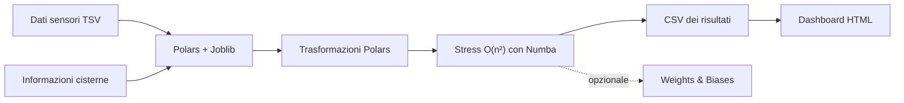
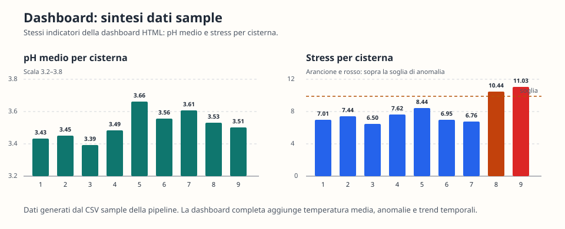
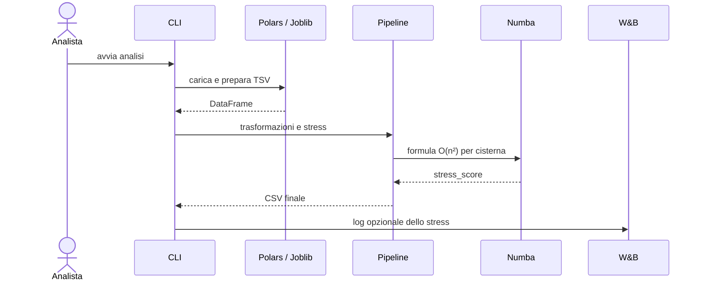

# Winery Adventures

Pipeline Python per monitorare le cisterne di fermentazione: trasforma dati
TSV in un CSV analitico e in una dashboard HTML leggibile. Il progetto resta
intenzionalmente piccolo, ma include OOP, Polars, Numba, Joblib, Weights &
Biases, Pytest, CI, UML e report prestazionale.

## Avvio rapido

```bash
python3 -m pip install uv
uv sync --locked --extra dev

uv run winery-adventures data/sensors_sample.tsv output/results.csv \
  --tank-info data/tank_info_sample.tsv --no-wandb --n-jobs 1
uv run winery-dashboard output/results.csv output/dashboard.html
```

Aprire `output/dashboard.html` nel browser. `output/` è ignorata da Git.



## Cosa produce

| Indicatore | Utilità |
|---|---|
| pH medio e numero di letture | Stato sintetico di ogni cisterna |
| Temperatura e deviazione da 26 °C | Evidenzia condizioni termiche non standard |
| Stress di fermentazione | Confronta la variabilità interna delle cisterne |
| Conteggio per vitigno | Disponibile quando si fornisce `--tank-info` |

La dashboard legge **solo** il CSV prodotto dalla pipeline: mostra pH,
temperatura, stress, anomalie semplici e trend. Il confronto delle temperature
permette di disattivare le singole cisterne.



*Anteprima statica dei dati sample: la dashboard completa aggiunge i trend
temporali e il filtro interattivo per cisterna.*

## Architettura essenziale



Le responsabilità sono separate in pochi moduli:

```text
winery_adventures/
├── io.py                # caricamento TSV, validazione e Joblib
├── transformations.py   # indicatori Polars
├── computations.py      # formula Numba dello stress
├── pipeline.py          # orchestrazione
├── reporting.py         # logging W&B opzionale
├── dashboard.py         # report HTML dal CSV
└── main.py              # CLI
```

I diagrammi completi sono disponibili in [docs/uml](docs/uml):
[classi](docs/uml/class_diagram.md), [sequenza](docs/uml/sequence_diagram.md)
e [casi d'uso](docs/uml/use_case_diagram.md).

## Installazione

Servono Python 3.10+ e `uv`. Il lockfile crea `.venv/` e blocca le versioni
delle dipendenze.

```bash
python3 -m pip install uv
uv sync --locked --extra dev
```

In alternativa:

```bash
python -m venv .venv
source .venv/bin/activate
python -m pip install -e ".[dev]"
```

Su Windows l'attivazione è `.venv\Scripts\Activate.ps1`.

## Esecuzione

```bash
# Pipeline locale e riproducibile sui dati sample
uv run winery-adventures data/sensors_sample.tsv output/results.csv \
  --tank-info data/tank_info_sample.tsv --no-wandb --n-jobs 1

# Dashboard dal CSV appena generato
uv run winery-dashboard output/results.csv output/dashboard.html
```

Per registrare lo stress su Weights & Biases, eseguire `wandb login` e omettere
`--no-wandb`.

## Qualità, test e prestazioni

```bash
uv run ruff check .
uv run ruff format --check .
uv run pytest

# Dataset grande e benchmark riproducibile
uv run python data_generator.py --rows 100000 --tanks 100
uv run python scripts/benchmark.py --rows 100000 --tanks 100
```

La CI esegue Ruff e Pytest su push e pull request verso `main`. Il benchmark
confronta la formula Python con Numba e misura la pipeline Polars + Joblib;
aggiorna [il report](docs/performance/performance_report.md).

## Decisioni tecniche

- **Polars** mantiene le trasformazioni colonnari e i raggruppamenti veloci.
- **Numba** compila la formula di stress richiesta, che è `O(n²)` per cisterna.
- **Joblib** prepara in parallelo le rilevazioni raggruppate per cisterna.
- **W&B** è opzionale: l'esecuzione locale e i test non richiedono rete.
- **Dashboard HTML**: nessun framework frontend; un file apribile localmente.
