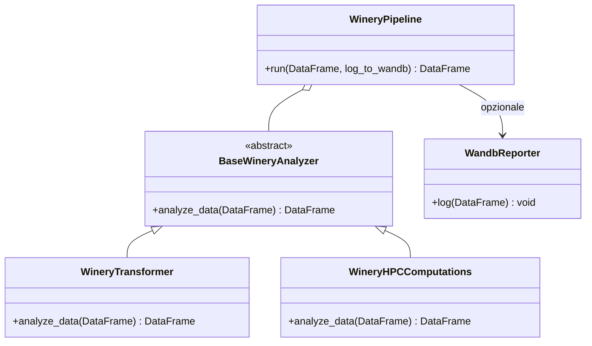

# Diagramma delle classi

```mermaid
classDiagram
    class BaseWineryAnalyzer {
        <<abstract>>
        +analyze_data(DataFrame) DataFrame
    }
    class WineryTransformer {
        +analyze_data(DataFrame) DataFrame
    }
    class WineryHPCComputations {
        +analyze_data(DataFrame) DataFrame
    }
    class WineryPipeline {
        +run(DataFrame, log_to_wandb) DataFrame
    }
    class WandbReporter {
        +log(DataFrame) void
    }
    BaseWineryAnalyzer <|-- WineryTransformer
    BaseWineryAnalyzer <|-- WineryHPCComputations
    WineryPipeline o-- BaseWineryAnalyzer
    WineryPipeline --> WandbReporter : opzionale
```
