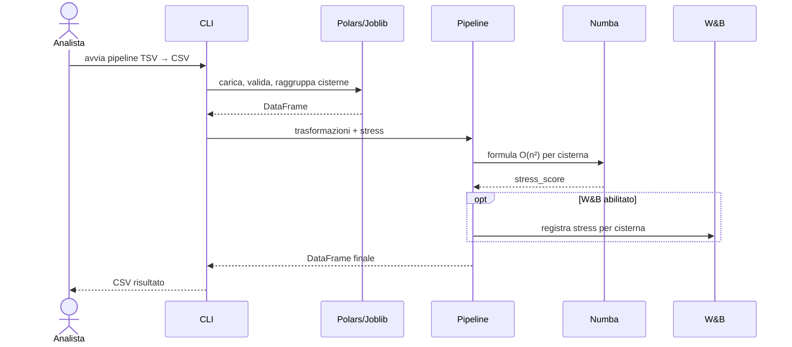

# Diagramma di sequenza

```mermaid
sequenceDiagram
    actor Analista
    participant CLI
    participant IO as Polars/Joblib
    participant Pipeline
    participant Numba
    participant W&B

    Analista->>CLI: avvia pipeline TSV → CSV
    CLI->>IO: carica, valida, raggruppa cisterne
    IO-->>CLI: DataFrame
    CLI->>Pipeline: trasformazioni + stress
    Pipeline->>Numba: formula O(n²) per cisterna
    Numba-->>Pipeline: stress_score
    opt W&B abilitato
        Pipeline->>W&B: registra stress per cisterna
    end
    Pipeline-->>CLI: DataFrame finale
    CLI-->>Analista: CSV risultato
```
