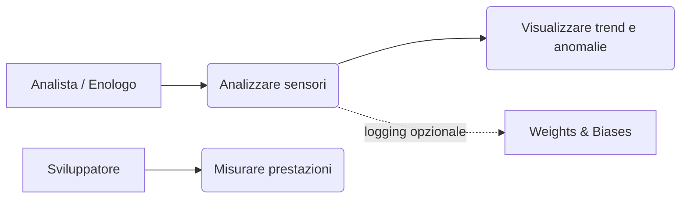

# Diagramma dei casi d'uso

```mermaid
flowchart LR
    Analista[Analista / Enologo]
    Sviluppatore[Sviluppatore]
    Pipeline(Analizzare sensori)
    Dashboard(Visualizzare trend e anomalie)
    Benchmark(Misurare prestazioni)
    WandB[Weights & Biases]

    Analista --> Pipeline
    Pipeline --> Dashboard
    Pipeline -. logging opzionale .-> WandB
    Sviluppatore --> Benchmark
```
